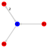

# PetriNetUtilities.jl

---

This package makes uses GraphPlot.jl to visualize reaction networks generated by DiffEqBiological.jl.

## Example

```julia
using PetriNetUtilities, DiffEqBiological, GraphPlot, Colors

rs = @reaction_network begin
  α, X --> 2X
  μ, X --> 0
  ν, 0 --> X
end α μ ν

petri_net = make_petri_net(rs)

# color the nodes of the graph
nodecolor = Dict(
  :X  => colorant"blue",
  :R1 => colorant"red",
  :R2 => colorant"red",
  :R3 => colorant"red"
);
nodefillc = map(node -> nodecolor[node], petri_net.nodelabel);

viz = gplot(petri_net,
  layout = spectral_layout,
  nodefillc = nodefillc,
  EDGELABELSIZE = 6,
  edgelabeldistx = 1.0)
```


